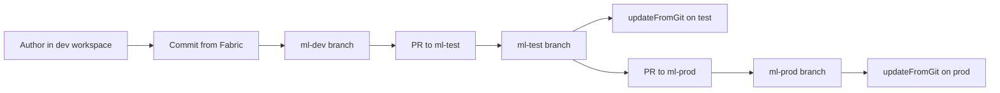

# Microsoft Fabric Platform Foundation

Environment-promoted Microsoft Fabric foundation built with Terraform for infrastructure and Fabric Git integration for item content, deployable as two independent lanes.

## Overview

This repository provisions and operates a Microsoft Fabric platform across three promoted environments. Responsibilities are split so that no two tools own the same object:

| Concern | Owner | Never touched by |
| --- | --- | --- |
| Fabric capacity, resource groups, Azure RBAC | Terraform (`azurerm`, `azuread`) | anything else |
| Fabric workspaces, capacity assignment, workspace roles, Git connection | Terraform (`microsoft/fabric`) | the portal |
| Notebooks, lakehouses, pipelines, semantic models, reports | Fabric Git integration | Terraform |
| Orchestration and approvals | GitHub Actions, or a workstation | Azure DevOps |

Items are authored in the `dev` workspace and committed **from** Fabric to its branch. Promotion is a merge between branches followed by an update-from-Git on the target workspace. Nothing is authored in the portal outside `dev`.

## Lanes

The same code builds two independent estates in one tenant, selected by `var.lane`:

| | `ml` | `gh` |
| --- | --- | --- |
| Built and operated by | A workstation | GitHub Actions |
| Guide | [docs/setup-manual-cli.md](docs/setup-manual-cli.md) | [docs/setup-github-actions.md](docs/setup-github-actions.md) |
| Workspaces | `contoso-fab-ml-{dev,test,prod}` | `contoso-fab-gh-{dev,test,prod}` |
| Capacity | `contosofabmlshared` | `contosofabghshared` |
| Resource group | `rg-contoso-fab-ml-fabric` | `rg-contoso-fab-gh-fabric` |
| State container | `tfstate-ml` | `tfstate-gh` |
| Git branches | `ml-dev`, `ml-test`, `ml-prod` | `gh-dev`, `gh-test`, `gh-prod` |
| Identity | You, via `az login` | `sp-fabric-cicd-gh` via OIDC |

`lane` defaults to `ml`, because a bare `terraform apply` is by definition the manual path. The workflows set `TF_VAR_lane: gh` explicitly, so a local run can never write to the lane CI owns.

The names above are defaults. `workspace_prefix` replaces the whole `<prefix>-<lane>` stem: set it to `my-contoso` and the workspaces become `my-contoso-{dev,test,prod}`, syncing with branches of the same name, with the capacity, resource group, connection and deployment pipeline following. Bootstrap takes it as `-WorkspacePrefix`, or as the `workspace_prefix` input on `bootstrap.yml`. Choose it before the first apply: renaming a workspace later means destroying and recreating it, and the items go with it.

The lane must be in the branch name too. Two workspaces pointed at one branch do not share it, they overwrite each other on every sync. A `workspace_prefix` satisfies this on its own, provided the two lanes are given different values.

Shared between lanes on purpose: the state storage account, the network security perimeter, and the three Entra security groups. Groups describe people, and the same people administer both; duplicating them is two objects to keep in step for no isolation gain.

An empty lane (`lane = ""`) reproduces the unsuffixed names that predate lanes. It exists so `terraform destroy` can still describe that estate. Do not build with it.

## File tree

```text
.
|-- .github/
|   |-- CODEOWNERS
|   |-- dependabot.yml
|   `-- workflows/
|       |-- bootstrap.yml             # seed credentials -> state, OIDC, environments, first apply
|       |-- terraform-plan.yml        # PR: fmt, validate, tflint, checkov, plan, PR comment
|       |-- terraform-apply.yml       # main: platform -> dev -> test -> prod -> pipeline
|       `-- terraform-destroy.yml     # dispatch-only: dismantles the gh lane
|-- docs/
|   |-- setup-manual-cli.md           # build and run the ml lane from a workstation
|   `-- setup-github-actions.md       # build and run the gh lane from CI
|-- infra/
|   |-- .tflint.hcl
|   |-- modules/
|   |   |-- fabric-capacity/          # azurerm_fabric_capacity
|   |   |-- fabric-workspace/         # fabric_workspace, role assignments, git
|   |   `-- azure-rbac/               # azurerm_role_assignment
|   |-- platform/                     # root: capacity, RBAC, connection, pipeline (1 state)
|   |   |-- backend.tf
|   |   |-- connection.tf
|   |   |-- deployment-pipeline.tf
|   |   |-- locals.tf
|   |   |-- main.tf
|   |   |-- outputs.tf
|   |   |-- platform.backend.hcl
|   |   |-- providers.tf
|   |   |-- terraform.tfvars
|   |   |-- variables-github.tf
|   |   `-- variables.tf
|   `-- workspace/                    # root: one workspace per env (3 states)
|       |-- backend.tf
|       |-- common.auto.tfvars        # shared values, auto-loaded
|       |-- locals.tf
|       |-- main.tf
|       |-- outputs.tf
|       |-- providers.tf
|       |-- variables-git.tf
|       |-- variables.tf
|       `-- envs/
|           |-- dev.backend.hcl       # + test, prod
|           `-- dev.tfvars            # + test, prod
|-- scripts/
|   |-- New-StateFoundation.ps1       # once per tenant: storage, perimeter, containers
|   |-- StateAccountHelpers.ps1       # shared, dot-sourced
|   |-- bootstrap.ps1                 # once per lane: groups, app registration, RBAC
|   |-- bootstrap.sh
|   |-- Add-MeToFabricGroups.ps1      # join the groups Terraform grants roles to
|   |-- add-me-to-fabric-groups.sh
|   |-- Load-Env.ps1                  # dot-source; .env -> TF_VAR_*
|   |-- load-env.sh
|   |-- Apply-Workspaces.ps1          # dev, test, prod with correct init pairing
|   |-- Grant-MyIpToPerimeter.ps1     # fixes 403s after your IP changes
|   |-- Enable-FabricGitIntegration.ps1
|   |-- Remove-Platform.ps1           # teardown, lane-scoped
|   `-- teardown.sh
|-- .env.example
|-- .gitignore
`-- README.md
```

Fabric item source lives in a **separate repository**, cloned as a sibling rather than nested. Terraform is promoted by pull request into `main`, while item branches are written by Fabric itself; keeping them apart stops item commits appearing in infrastructure reviews.

## Prerequisites

### Tooling

* Terraform 1.11.0 or later. Write-only attributes, used for the GitHub PAT, require it
* Azure CLI 2.60 or later, plus the preview extension: `az extension add --name microsoft-fabric --allow-preview true`. The name is `microsoft-fabric`, not `fabric`
* PowerShell 7.x for the scripts
* An Azure subscription with non-zero Fabric capacity-unit quota in the target region

Quota is per region and defaults to zero. Check before choosing a region, or capacity creation fails after everything else has succeeded:

```bash
az rest --method GET \
  --url "https://management.azure.com/subscriptions/<sub>/providers/Microsoft.Fabric/locations/<region>/usages?api-version=2023-11-01"
```

### Fabric tenant settings

Terraform cannot manage these. `scripts/Enable-FabricGitIntegration.ps1` enables them through a device-code app holding `Tenant.ReadWrite.All`, because the Azure CLI's Fabric token carries only `user_impersonation` and cannot call `/v1/admin/*` regardless of role. It is a manual step: the admin API accepts only a signed-in Fabric administrator, so CI does not run it. Repeat it whenever the security groups are recreated, since Fabric stores the group object ID rather than its name.

| Setting | Why | Needed by |
| --- | --- | --- |
| Users can synchronise workspace items with a GitHub repository | Git integration | both lanes |
| Service principals can use Fabric APIs | Every provider call returns 401 without it | `gh` only |
| Service principals can create workspaces, connections and deployment pipelines | `fabric_workspace` | `gh` only |

Changes take up to 15 minutes to propagate. A run that fails immediately after enabling them is expected; re-run it.

### Entra ID security groups

Both roots read these through `azuread_group` data sources, so `plan` fails with "no group found" if any is missing.

| Group | Purpose |
| --- | --- |
| `sg-fabric-platform-admins` | Capacity administration, break-glass, local Terraform runs |
| `sg-fabric-data-engineers` | Item authoring in `dev` |
| `sg-fabric-analysts` | Report consumption |

Terraform reads them but never creates them, so membership stays under identity governance. For a sandbox, `scripts/bootstrap.ps1 -CreateGroups` creates any that are missing and adds you to the admin group.

Workspace roles are granted to these groups and never to individuals, so a person sees nothing until they join one. `scripts/Add-MeToFabricGroups.ps1` adds the signed-in user, checking membership first so it is safe to re-run. It has to be repeated after a rebuild: Fabric stores the group's object ID, and a recreated group is a new object.

## Getting started

Choose one operating lane. For the GitHub Actions lane, configure the federated bootstrap service principal variables and two GitHub secrets, then dispatch `.github/workflows/bootstrap.yml`. It creates state, permanent OIDC trust, the items repository, environments and the first deployment. See [setup with GitHub Actions](docs/setup-github-actions.md).

Either lane must run `scripts/Enable-FabricGitIntegration.ps1` before the first
Terraform apply. Fabric blocks service principals and GitHub sync by default, and
only a signed-in administrator can lift that, so no workflow and no service
principal can do it for you.

The manual lane uses two scripts because they have different lifetimes:

```powershell
# Once per tenant: state storage, perimeter, one container per lane
./scripts/New-StateFoundation.ps1 -UpdateBackendConfigs

# Once per lane: groups, RBAC, and for gh the app registration
./scripts/bootstrap.ps1 -CreateGroups

# Tenant settings, interactive device code
./scripts/Enable-FabricGitIntegration.ps1

# Then
Copy-Item .env.example .env
. ./scripts/Load-Env.ps1

# Platform, without the deployment pipeline: it assigns workspaces that do not exist yet
cd infra\platform; terraform init -reconfigure -backend-config="platform.backend.hcl"; terraform apply -var=create_deployment_pipeline=false; cd ..\..
. ./scripts/Load-Env.ps1        # reload with the connection GUID
./scripts/Apply-Workspaces.ps1

# Platform again, now that the workspaces exist, to create the pipeline
cd infra\platform; terraform apply; cd ..\..

# Join the groups Terraform granted the workspace roles to
./scripts/Add-MeToFabricGroups.ps1
```

Follow the guide for your lane rather than this summary: [manual](docs/setup-manual-cli.md), [GitHub Actions](docs/setup-github-actions.md).

### Every input is optional

No Terraform variable is required. Identity values resolve from the current session when omitted:

| Variable | Null resolves to |
| --- | --- |
| `tenant_id` | Tenant of the `az login` or OIDC session |
| `subscription_id` | Subscription of the current session |
| `cicd_service_principal_object_id` | Whoever is running Terraform |
| `workspace_prefix` | `<prefix>-<lane>`, so workspaces are `<prefix>-<lane>-<environment>` |
| `capacity_display_name` | `<prefix>-<lane>-<capacity_key>` |
| `git_branch_name` | `<workspace_prefix>-<environment>`, or `<lane>-<environment>` when no prefix is set |
| `github_connection_name` | `<prefix>-<lane>-items` |

A null service principal is not a fallback, it is the `ml` lane's identity model: there is no CI principal, so the operator holds the standing access. An unused app registration with Contributor and User Access Administrator on the subscription is a liability rather than an asset.

`.env` follows the same rule. Every key can be blank, and blanks are resolved from `az login`. An untouched copy of `.env.example` is a working configuration for the `ml` lane.

## Promotion flow

Branch names below are the `ml` lane defaults; a `workspace_prefix` replaces the
`ml-` stem with its own.



Infrastructure promotion is separate and runs through Terraform:

```text
apply-platform -> apply-dev -> apply-test -> apply-prod -> apply-deployment-pipeline
```

`updateFromGit` is a long-running operation. A 202 is not completion; poll `git/status` until `workspaceHead == remoteCommitHash`.

## Role model

Human write access is removed as changes move towards production.

| Environment | `sg-fabric-platform-admins` | `sg-fabric-data-engineers` | `sg-fabric-analysts` | Operator or CI principal |
| --- | --- | --- | --- | --- |
| `dev` | Admin | Member | Viewer | Admin |
| `test` | Admin | Viewer | Viewer | Admin |
| `prod` | Viewer | Viewer | Viewer | Admin |

Break-glass in `prod` is a `role_overrides` entry submitted as a reviewed pull request, or a temporary grant made by a Fabric tenant administrator and recorded in the incident log.

## Capacity topology

The `capacities` map in `infra/platform/terraform.tfvars` is the single switch:

```hcl
# Default: one F2 shared by dev, test and prod
capacities = {
  shared = { sku = "F2" }
}

# Dev and test share; prod isolated
capacities = {
  nonprod = { sku = "F2" }
  prod    = { sku = "F8" }
}
```

Point an environment at a capacity with `capacity_key` in the matching `envs/<env>.tfvars`. Set `capacity_key = ""` to leave a workspace unassigned.

### Pause and resume

The provider does not model capacity state, so pausing creates no drift:

```bash
az fabric capacity suspend --capacity-name contosofabmlshared --resource-group rg-contoso-fab-ml-fabric
az fabric capacity resume  --capacity-name contosofabmlshared --resource-group rg-contoso-fab-ml-fabric
```

By default the provider verifies the capacity is Active before touching a workspace, which fails while suspended. `skip_capacity_state_validation = true` is set for `dev` and deliberately left off for `test` and `prod`: with it enabled the provider can no longer detect an inactive capacity, and a later apply may drop workspace items from state.

## Terraform state

State lives in Azure Storage. There is no local state; both roots declare a partial `backend "azurerm" {}` that fails `terraform init` unless a backend config is supplied.

| Root | Backend config | Blob | Container |
| --- | --- | --- | --- |
| `infra/platform` | `platform.backend.hcl` | `platform.tfstate` | `tfstate-<lane>` |
| `infra/workspace` | `envs/dev.backend.hcl` | `workspace-dev.tfstate` | `tfstate-<lane>` |
| `infra/workspace` | `envs/test.backend.hcl` | `workspace-test.tfstate` | `tfstate-<lane>` |
| `infra/workspace` | `envs/prod.backend.hcl` | `workspace-prod.tfstate` | `tfstate-<lane>` |

The committed files name `tfstate-ml`. The other lane is selected at init, not by a second set of files, because a later `-backend-config` wins:

```powershell
terraform init -reconfigure `
    -backend-config=platform.backend.hcl `
    -backend-config="container_name=tfstate-gh"
```

A container per lane rather than a shared container with different blob names, because an RBAC assignment can be scoped to a container and a blob prefix cannot. The boundary is there if you later need to give CI access to its own state without handing it the manual lane's.

Protections applied by `New-StateFoundation.ps1`:

* `--allow-shared-key-access false`, so access keys and SAS tokens cannot be used. Every read and write is an Entra identity, matched by `use_azuread_auth = true`
* `--allow-blob-public-access false` and `--min-tls-version TLS1_2`
* Blob versioning plus 30-day soft delete for blobs and containers
* Standard_ZRS replication
* A `CanNotDelete` lock on the resource group

State locking is the native azurerm blob lease, reinforced by `concurrency` groups in the workflows.

### Network security perimeter

The account sits inside a perimeter in `Enforced` mode. Inbound rules admit resources in the subscription and specific IP addresses.

GitHub-hosted runners are outside the subscription rule. The workflows therefore add each runner's current public IP before `terraform init`; Entra RBAC still controls state access. A private or self-hosted runner in the subscription can rely on the existing `inbound-subscription` rule instead.

Your own IP changes; `./scripts/Grant-MyIpToPerimeter.ps1` takes no arguments and fixes the resulting 403s.

### Where variable values come from

| Kind | Example | Lives in | Committed |
| --- | --- | --- | --- |
| Structural configuration | `prefix`, `location`, `capacities`, `tags`, group names | `terraform.tfvars`, `common.auto.tfvars` | yes |
| Per-environment settings | `environment`, `role_overrides` | `envs/<env>.tfvars` | yes |
| Tenant identifiers | tenant, subscription, service principal object ID | environment variables | **no** |

Precedence, lowest to highest: defaults, `TF_VAR_*`, `terraform.tfvars`, `*.auto.tfvars` alphabetically, `-var-file`, `-var`.

`TF_VAR_*` sits **below** the tfvars files, so a value in both means the file wins. That is why the tenant identifiers appear in no file at all.

## Local development

```bash
az login --tenant <tenant>
az account set --subscription <subscription>
```

Every provider picks the session up. `azurerm` and `azuread` fall back to CLI credentials; the Fabric provider defaults `use_cli` to true; the backend uses `use_azuread_auth`.

`ARM_USE_OIDC` is set by the workflows and must stay unset locally. If it leaks into your shell, `terraform init` fails trying to exchange a GitHub token that does not exist.

Switching environments in the same directory requires `-reconfigure`, because each has its own state file. `scripts/Apply-Workspaces.ps1` always pairs `init -reconfigure` with the matching `-var-file`, which is the point of the script:

> Running `apply -var environment=prod` against the dev backend does not create prod. It **renames** the dev workspace.

For standing local values, `local.auto.tfvars` is auto-loaded and already gitignored. Keep credentials out of it. There are none to store: authentication is `az login` locally and OIDC federation in CI, and there is no `AZURE_CLIENT_SECRET` anywhere in this repository.

## Teardown

Destructive and irreversible. OneLake data is deleted with the workspace.

```powershell
./scripts/Remove-Platform.ps1 -Lane ml -IncludeBranches -WhatIf   # preview
./scripts/Remove-Platform.ps1 -Lane ml -IncludeBranches
```

Order is not negotiable, and two steps are not obvious:

1. **Deployment pipelines first.** Fabric refuses to delete a workspace assigned to a stage
2. Resume the capacity if paused, or workspace deletes fail
3. Workspaces, prod first so a failure stops before dev
4. Platform, then an **orphan sweep** by name
5. App registration, branches, groups, state

The orphan sweep matters. `terraform destroy` only removes what state records, so anything deleted out of band, created before a failed apply, or lost with a discarded state file survives and silently blocks the next build. `-OrphansOnly` skips Terraform entirely for when state is gone.

Shared resources are opt-in: `-IncludeGroups`, `-IncludeState`. Deleting state while a lane still stands strands it permanently.

Use `-Legacy` for the unsuffixed estate that predates lanes. Note that its prefix also matches both lanes, so it is a whole-estate wipe rather than a surgical one.

Not removed by any script: Fabric tenant settings, and GitHub Environments and variables. Neither is reachable with CLI auth.

## Fabric features Terraform does not cover

| Feature | Provider support | How this repository handles it |
| --- | --- | --- |
| Item content | Partial and lagging | Fabric Git integration, branch per environment |
| Fabric tenant settings | None | `scripts/Enable-FabricGitIntegration.ps1` |
| Capacity pause, resume, scheduled scaling | None | `az fabric capacity suspend`/`resume` |
| Stage deployment between pipeline stages | Pipeline creation only | Not used. Promotion is Git-driven |
| Connections and gateways | Create supported since 1.2 | `fabric_connection` in the platform root, PAT as a write-only attribute |
| OneLake shortcuts | Not modelled | Defined in item source, or created by a notebook |
| Domains | Available in recent versions | Out of scope until the tenant adopts domains |
| Semantic model refresh, RLS/OLS roles | None | Post-deployment step, not implemented |

## Known-invalid item definitions

Do not hand-author Fabric item folders. A `.platform` file alone is **not** a valid definition and causes `MissingItemDefinitionFiles`; this was proven by bisection for Lakehouse items.

Create items in the `dev` workspace, then commit **from** Fabric so the workspace writes a valid definition. It then promotes through `test` and `prod` by merging branches.

Item source lives in the separate items repository, never here. This repository owns infrastructure only.

## Action pinning

Workflows pin to major version tags such as `actions/checkout@v4`, and Dependabot raises update pull requests. To harden further, replace each tag with the full commit SHA and keep the tag as a trailing comment:

```yaml
- uses: actions/checkout@11bd71901bbe5b1630ceea73d27597364c9af683 # v4.2.2
```

Dependabot rewrites the SHA and the comment together, so the readable version is never lost.
